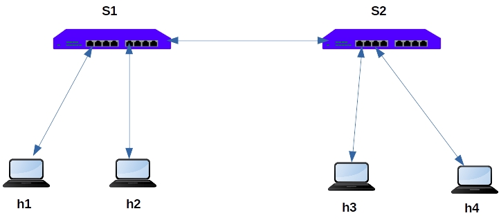
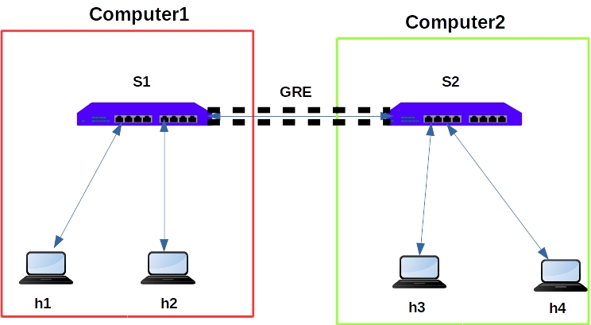

## 1. Introduction

Generally we use mininet to simulate the topology in a single system/computer/virutal machine. The System resources limits our topology size. 

Suppose, we want to build the large  topology with 1000s of switches and nodes. We cannot build this topology in single system. The solution is, we can build the subset of the topology in mulitiple systems and connect each other system via GRE Tunnel.

---

## 2. Demonstration

Lets take the simple topology and demonstrated on deploying on two VMs, interconnect the topology and ping the nodes.

This is original topology.

This deployment model of this topology.

1. We are going to split the original topology in to two small topologies.

2. In our diagram, S1, h1, h2 will be considered as topology1, will be 	deployed in computer1.

3. S2, h3, h4 will be considered as topology2, will be deployed in computer2.

4. We must note down the IP Address of the both computers for establishing GRE Tunnel.  This IP Address details will be used in the topology file.

5. The example topology files can be downloaded from here. (Computer1 IP : 192.168.122.1,  Computer2 IP: 192.168.122.2)

* [Topology1 file](topo1.py.txt) 

* [Topology2 file](topo2.py.txt)

6. Both topology is connected to the one RYU SDN controller (we run RYU SDN controller on computer1).

**In Computer1:**

1. Start the RYU SDN Controller with simple switch application

> **ryu-manager ryu.app.simple_switch_13**

2. Start the mininet topology 

> **sudo python topo1.py**

**In Computer2:**

1. Start the mininet topology 

> **sudo python topo2.py**

2. From computer1 mininet shell, ping h1, h2, h3, h4 host IPs.

3. you can also verify the GRE interface of both computers using "ifconfig" command.
