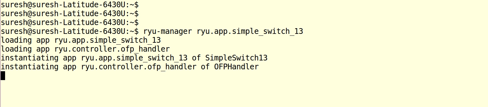
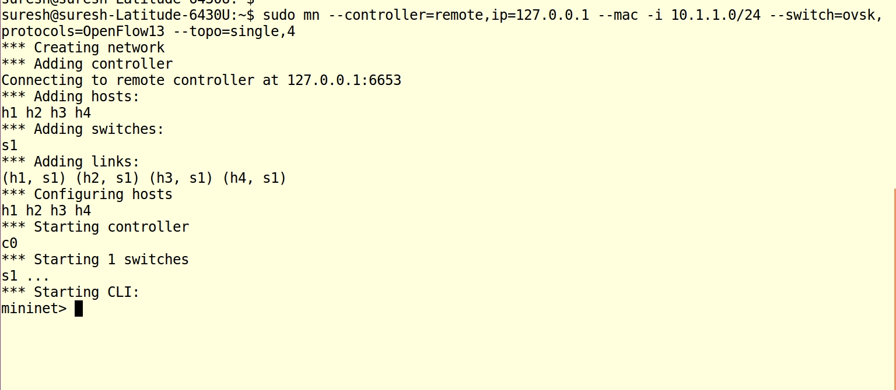
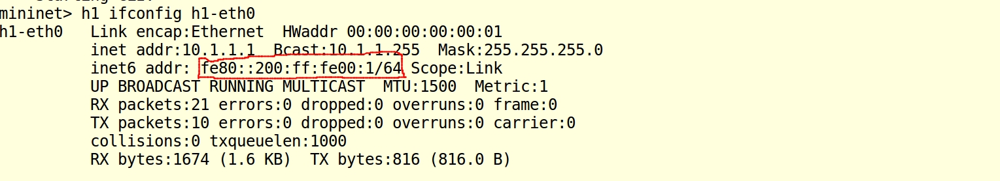
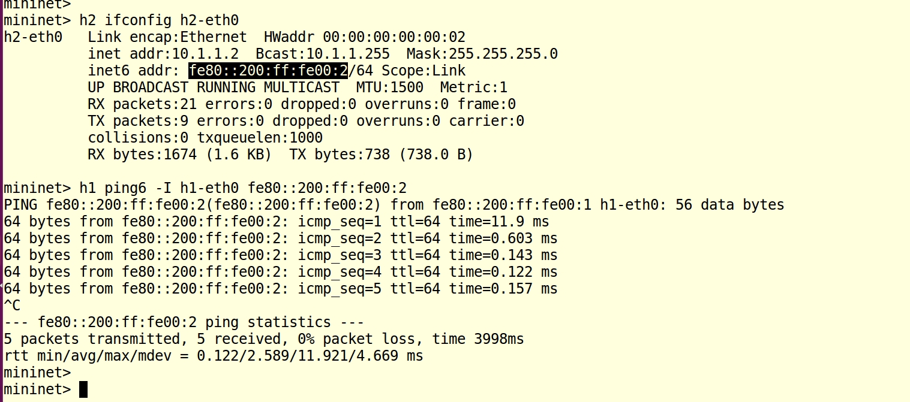
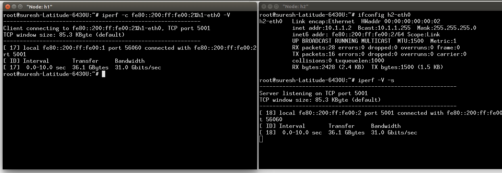

## 1. Introduction

Generally we use IPv4 in all our networking devices/environment/test bed. But Some special cases requires IPv6 address. There are plenty of resources available in the internet for Mininet with IPv4. 

In this blog, we discuss about using the IPv6 addresses in the Mininet Topology. We also discuss about, How to do Ping and TCP, UDP Traffic Tests (IPerf) with IPv6 addresses.

Some basic concepts of IPv6 addresses

### A. IPv6 Link Local Address

Link-local address is a IPv6 unicast address that is valid only for communications within the network segment (link) or the broadcast domain. Link-local addresses are autoconfigured. Link local address prefix is FE80::/10 .  Example Link local addresses are fe80::200:ff:fe00:1/64,fe80::200:ff:fe00:1/64. 

### B. IPv6 Global Unicast Address

The global unicast address is globally unique in the Internet. Examples: 2001::1/64, 2001::2/64

---

## 2. Testing

**Objective**  Lets use the RYU Controller with Mininet Single Topology(4 switchs).

### A. Start the Ryu controller

Start the Ryu Controller with Simple Openflow 1.3 Switch application as below,

> **ryu-manager ryu.app.simple_switch_13**

#### B. Create a Single Topology in Mininet

> **sudo mn --controller=remote,ip=127.0.0.1 --mac -i 10.1.1.0/24 --switch=ovsk,protocols=OpenFlow13 --topo=single,4**

** Note: In the Mininet topology, Host interfaces comes up with default IPv6 Link Local address. **

#### C. Verify the Host IPv6 addresses

In the mininet terminal, issue the below command,

>  h1 ifconfig h1-eth0
>  h2 ifconfig h1-eth0
>  h3 ifconfig h1-eth0
>  h4 ifconfig h1-eth0

#### C. Ping Test between Host1 to Host2

**ping6 utility is used for IPv6 Ping**

##### Syntax :

> **ping6 -I <interface>  [Link local address | Unicast address]**

Example:

> **h1 ping6 -I h1-eth0  fe80::200:ff:fe00:2**

#### D. IPERF TCP Test (Host1 to Host2)

In IPERF "-V" option is used for enabling IPv6.

**To run the TCP server:**

Run this IPerf Server in Host2(h2)

Note: open xterm for hosts, to run the iperf tests.

> iperf -V -s

**To run the TCP Client:**

> iperf -c <unicast address> -V
> iperf -c 2001:2 -V
> iperf -c <link local address%interface name> -V
> iperf -c fe80::200:ff:fe00:2%h1-eth0 -V

In our case, we are using the Link Local address, hence we using this below command,

Run this IPerf Client in Host1(h1), connecting to h2.

> **iperf -c fe80::200:ff:fe00:2%h1-eth0 -V**

Note: we need to specify IPv6 link local address in this  "IPv6-address%interface" format.

UDP Test is similar to above. 

#### E. Testing in IPv6 Unicast address 

**Assign the IPv6 global unicast address to hosts**

> h1 ifconfig h1-eth0 inet6 add 2001::1/64
> h2 ifconfig h2-eth0 inet6 add 2001::2/64

**Ping Test**

> h1 ping6 -I h1-eth0  2001::2
> h2 ping6 -I h2-eth0  2001::1

** TCP Test **

Start the Tcp Server in h2

> iperf -V -s

Start the Tcp Client in h1

> iperf -c  2001::2 -V

#### E. To check the IPv6 routes

> ip -6 route 

### Reference: 

1. https://iperf.fr/iperf-doc.php#ipv6
