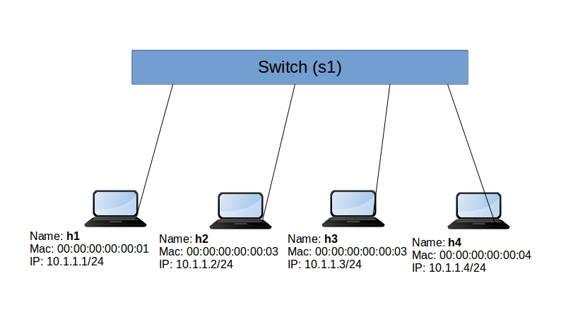
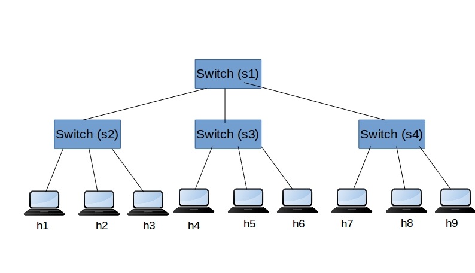

# Mininet


Version: 1.0.1


------

>KNET Solutions (Online Training Centre),
>
>http://knetsolutions.in                               
>
>knetsolutions2@gmail.com
>
>Phone/WhatsApp: +919445042007
>
>we provide Academic SDN Project assistance/guidance. 
>

---


## 1. To check the mininet version 


```
mn --version
```


## 2. To clean up the existing ovs bridges and namespaces


Note: sometime we mistakenly closed the mininet shell, or mininet crashed. But the topology components will continue to exists. To clean such stuff, cleanup command is used.


```
mn -c
```


## 3. Our First Topology (Single)  


Topology with Single Switch and 4 Nodes.



RYU SDN Controller 

```
ryu-manager ryu.app.simple_switch_13
```

Mininet Topology

```
sudo mn --controller=remote,ip=127.0.0.1 --mac -i 10.1.1.0/24 --switch=ovsk,protocols=OpenFlow13 --topo=single,4
```


|  options    |    Description                                                        |
|-------------|-----------------------------------------------------------------------|
|--controller | type of controller local/remote and remote controller ip.             |
|             |  																	  |
|--mac        | mac address starts with 00:00:00:00:00:01							  |
|             |																		  |
|-i           | IP Subnets for the Topology 										  |
|             |																		  |
|--switch     | Switch type (ovsk - openvswitch kernel module), and openflow version. |
|             |																		  |
|--topo       | topology type(linear,minimal,reversed,single,torus,tree) and params.  |


Once you are done, make sure "exit" the mininet shell,
>exit

Example:

```
mininet> exit
*** Stopping 1 controllers
c0 
*** Stopping 4 links
....
*** Stopping 1 switches
s1 
*** Stopping 4 hosts
h1 h2 h3 h4 
*** Done
completed in 2.604 seconds
suresh@suresh-vm:~$ 
```

## 4. Mininet Basic Shell Commands


**Informative commands**


```
help
dump
net
links
```

**Action commands**

```
pingall
```


**Execute the commands in HOST/Node:**


Option1:

we can login to each host using 'xterm' command

>xterm h1

```
mininet>xterm h1
```

It will open a xterm terminal for the host. Now we can execute the command inside that terminal


Option2:

we can directly execute from the mininet shell. 

```
mininet><hostname> command
```

Example:

```
mininet>h1 ifconfig
mininet>h1 ping h2
mininet>h1 ip route
```

we can use either method to run the Traffic tests or executing the commands.


## 5. Linear Topology 

linear topology (where each switch has one host, and all switches connect in a line)


```
sudo mn --controller=remote,ip=127.0.0.1 --mac -i 10.1.1.0/24 --switch=ovsk,protocols=OpenFlow13 --topo=linear,4
```


## 6. Tree Topology 




```
sudo mn --controller=remote,ip=127.0.0.1 --mac -i 10.1.1.0/24 --topo=tree,depth=2,fanout=3

```


fanout : each switch is connected to these many childs
depth : depth of the tree


## 7. Mininet Running Traffic Tests


### 1. TCP/UDP Traffic Tests


#### a. Setup the Topology with xterms options (open terminal for each Node)


```
sudo mn --controller=remote,ip=127.0.0.1 --mac -i 10.1.1.0/24 --switch=ovsk,protocols=OpenFlow13 --topo=linear,4  -x
```

#### a.  TCP Traffic Test between h1 to h4


Run IPERF TCP Server in h4

```
iperf -s

```
-s means server mode


RUN IPERF TCP Client in h1


```
iperf -c 10.1.1.4 -i 10 -t 30
iperf -c 10.1.1.4 -i 10 -b 10m -t 30
iperf -c 10.1.1.4 -i 10 -P 10 -t 30

```

-c means client mode.

-i means reporting interval

-t means test duration in seconds

-b means bandwidth 10m means 10Mbps

-P means parallel connections


#### b.  UDP Traffic Test between h1 to h4


Run IPERF UDP Server in h4

```
iperf -u -s 

```
-u means udp 

RUN IPERF UDP Client in h1


```
iperf -u -c 10.1.1.4 -b 10m -i 10 -t 30
iperf -u -c 10.1.1.4 -b 10m -i 10 -P 10 -t 30

```

-b means bandwidth 10m means 10Mbps


### 2. HTTP Traffic Tests


Run Python Simple Web Server in h4


```
python -m SimpleHTTPServer 80

```

From H1, Access the Web server

```
curl http://10.1.1.4/

```

curl utility used as web client to access the web server. 


If we want to simulate the 1000s users accessing the web server on the same time (load), we can use ab(apache bench) tool

```
ab -n 500 -c 50 http://10.1.1.4/
```

-c  50  means parallel request per second (50 Requests per second)

-n 500  means total request for this test (500 requests)


Apache bench tool have lot more options , More details can be found from the below link

https://httpd.apache.org/docs/2.4/programs/ab.html


## 8. Writing Custom Topology in Mininet

mininet exposes the python API. We can create a custom topologies using the python API with few lines of code.  


### How to write Custom Topology in Mininet

Steps are below.


1. Import the python required libraries

 ``` 
from mininet.topo import Topo
from mininet.net import Mininet
 ```

2. Write the Topology definition class

 ``` 
 class SingleSwitchTopo(Topo):
    def build(self):
        s1 = self.addSwitch('s1')

        h1 = self.addHost('h1')
        h2 = self.addHost('h2')
        h3 = self.addHost('h3')
        h4 = self.addHost('h4')  

        self.addLink(h1, s1)
        self.addLink(h2, s1)
        self.addLink(h3, s1)
        self.addLink(h4, s1)
 ```

Important Topology definition APIs:

	addSwitch
	addHost
	addLink


3. Run the Topology as below,
 - Create the Topology object
 - Create the Mininet with Topology object
 - Start the Mininet


``` 
if __name__ == '__main__':
    topo = SingleSwitchTopo()
    c1 = RemoteController('c1', ip='127.0.0.1')
    net = Mininet(topo=topo, controller=c1)
    net.start()
```

### How to run

1. start the RYU SDN Controller

```
ryu-manager ryu.app.simple_switch_13

```


2. Run the Mininet topology file


```
sudo python <topology file name>

```

3. Perform your tests/operation etc.


###  Exercises

- Single Topology
- Linear Topology
- Ring Topology
- Executing commands in the topology file
- Automate the Link Changes(Link UP & Down)


---

## 9. Further exercises

- Data Center Topology
- Connecting to Internet
- Configure Multiple Controllers

---

## 10. References

1. https://github.com/mininet/mininet/wiki/Introduction-to-Mininet

2. https://github.com/mininet/mininet/tree/master/examples

3. http://mininet.org/api/annotated.html

5. https://kiranvemuri.info/dynamic-topology-changes-in-mininet-advanced-users-5c452f7f302a

6. https://stackoverflow.com/questions/43070043/mininet-wifi-custom-topology
https://stackoverflow.com/questions/43070043/mininet-wifi-custom-topology

7. http://mininet.org/walkthrough/

8. https://github.com/PrincetonUniversity/Coursera-SDN/tree/master/assignments/mininet-topology

9. https://www.pythonforbeginners.com/modules-in-python/how-to-use-simplehttpserver/

