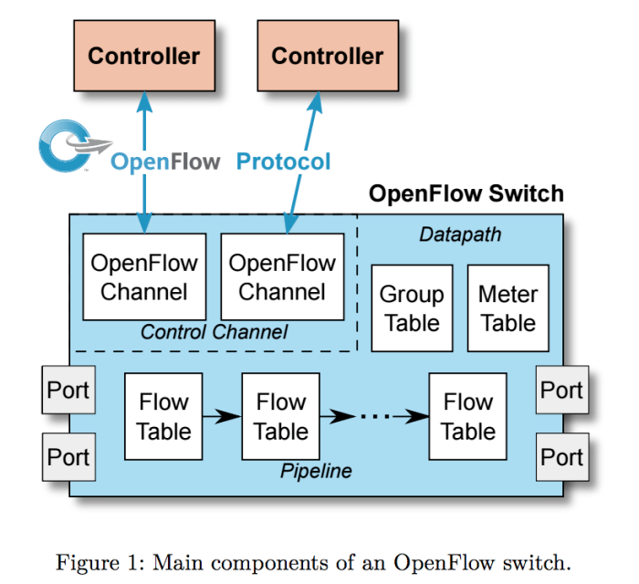
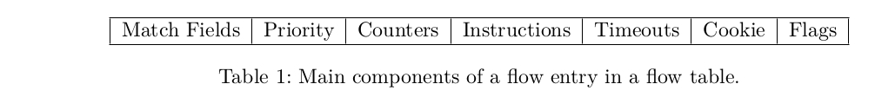
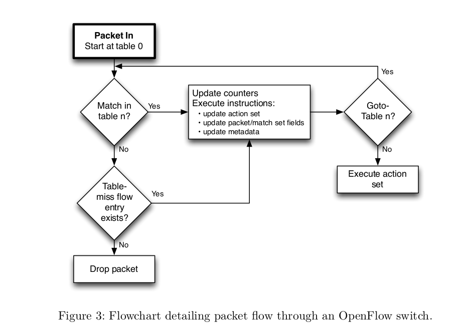

# Openflow 


version: 1.0.1


------

>KNET Solutions (Online Training Centre),
>
>http://knetsolutions.in                    		   
>
>knetsolutions2@gmail.com
>
>Phone/WhatsApp: +919445042007
>
>we provide Academic SDN Project assistance/guidance. 
>

------


This document text is copied from the Openflow 1.3 specifications

https://www.opennetworking.org/software-defined-standards/specifications/


## 1. Introduction

The OPENFLOW specification covers the components and the basic functions of the switch, and the OpenFlow switch protocol to manage an OpenFlow switch from a remote OpenFlow controller.


Openflow Version Details:

Openflow 1.1

Openflow 1.2

Openflow 1.3

Openflow 1.4

Openflow 1.5

Most widley supported: 1.3


## 2. Switch Components

An OpenFlow Logical Switch consists of one or more flow tables and a group table, which perform packet lookups and forwarding, and one or more OpenFlow channels to an external controller (Figure 1). 




* The switch communicates with the controller and the controller manages the switch via the OpenFlow switch protocol.


* Using the OpenFlow switch protocol, the controller can add, update, and delete flow entries in flow tables, both reactively (in response to packets) and proactively. 


* Each flow table in the switch contains a set of flow entries; each flow entry consists of match fields, counters, and a set of instructions to apply to matching packets.


* Matching starts at the first flow table and may continue to additional flow tables of the pipeline
* Flow entries match packets in priority order, with the first matching entry in each table being used. 
* If a matching entry is found, the instructions associated with the specific flow entry are executed. 
* If no match is found in a flow table, the outcome depends on configuration of the table-miss flow entry: for example, the packet may be forwarded to the controllers over the OpenFlow channel, dropped, or may continue to the next flow table


* Actions included in instructions describe packet forwarding, packet modification and group table processing. 

* Flow entries may forward to a port. This is usually a physical port, but it may also be a logical port defined by the switch(such as link aggregation groups, tunnels or loopback interfaces) or a reserved port defined by this specification. 


## 3.  Openflow channel

* The OpenFlow channel is the interface that connects each OpenFlow Logical Switch to an OpenFlow controller. Through this interface, the controller configures and manages the switch, receives events from the switch, and sends packets out the switch. 

* The Control Channel of the switch may support a single OpenFlow channel with a single controller, or multiple OpenFlow channels enabling multiple controllers.

* The OpenFlow channel is usually encrypted using TLS, but may be run directly over TCP

* Default Port number : 6653


## 4. Openflow Flow table:

A flow table entry is identified by its match fields and priority: the match fields and priority taken  together identify a unique flow entry in a specific flow table. 

A flow table consists of flow entries.



**Example Flows with MAC Match**


```
 cookie=0x0, duration=4.742s, table=0, n_packets=2, n_bytes=196, priority=1,in_port="s1-eth2",dl_src=00:00:00:00:11:12,dl_dst=00:00:00:00:11:11 actions=output:"s1-eth1"
 cookie=0x0, duration=4.738s, table=0, n_packets=1, n_bytes=98, priority=1,in_port="s1-eth1",dl_src=00:00:00:00:11:11,dl_dst=00:00:00:00:11:12 actions=output:"s1-eth2"
 cookie=0x0, duration=5.781s, table=0, n_packets=29, n_bytes=3102, priority=0 actions=CONTROLLER:65535

```


**Example Flows with IP Match**

```
 cookie=0x0, duration=12.927s, table=0, n_packets=2, n_bytes=196, priority=1,ip,nw_src=192.168.1.1,nw_dst=192.168.1.2 actions=output:"s1-eth2"
 cookie=0x0, duration=12.918s, table=0, n_packets=2, n_bytes=196, priority=1,ip,nw_src=192.168.1.2,nw_dst=192.168.1.1 actions=output:"s1-eth1"
 cookie=0x0, duration=12.959s, table=0, n_packets=37, n_bytes=3844, priority=0 actions=CONTROLLER:65535
```

**Example Flows with TCP/UDP Ports Match**

```
suresh@suresh-vm:~$ sudo ovs-ofctl -O OpenFlow13 dump-flows s1
 cookie=0x0, duration=3.933s, table=0, n_packets=238752, n_bytes=11069190464, priority=1,tcp,nw_src=192.168.1.2,nw_dst=192.168.1.1,tp_src=37304,tp_dst=5001 actions=output:"s1-eth1"
 cookie=0x0, duration=3.906s, table=0, n_packets=192421, n_bytes=12699810, priority=1,tcp,nw_src=192.168.1.1,nw_dst=192.168.1.2,tp_src=5001,tp_dst=37304 actions=output:"s1-eth2"
 cookie=0x0, duration=31.495s, table=0, n_packets=43, n_bytes=4309, priority=0 actions=CONTROLLER:65535
suresh@suresh-vm:~$ 
```


**match fields:** to match against packets. These consist of the ingress port and packet headers, and optionally other pipeline fields such as metadata specified by a previous table

**priority:** matching precedence of the flow entry.

**counters:** updated when packets are matched.

**instructions:** to modify the action set or pipeline processing.

**timeouts:** maximum amount of time or idle time before flow is expired by the switch.

**cookie:** opaque data value chosen by the controller. May be used by the controller to filter flow entries affected by flow statistics, flow modification and flow deletion requests. Not used when processing packets.

**flags:** flags alter the way flow entries are managed, for example the flag OFPFF_SEND_FLOW_REM triggers flow removed messages for that flow entry.


The flow entry that wildcards all match fields (all fields omitted) and has priority equal to 0 is called the table-miss flow entry.

The table-miss flow entry must support at least sending packets to the controller using the CONTROLLER reserved port.


### Openflow Matching:

On receipt of a packet, an OpenFlow Switch performs the functions shown as below. 



The switch starts by performing a table lookup in the first flow table, and based on pipeline processing, may perform table lookups in other flow tables

### Match Fields:

**Reference : Page 62 of the specification**

```
Switch input port. */
Switch physical input port. *
Ethernet destination address. */
Ethernet source address. */
Ethernet frame type. */
VLAN id. */
VLAN priority. */
IP DSCP (6 bits in ToS field). */
IP ECN (2 bits in ToS field). */
IP protocol. */
IPv4 source address. */
IPv4 destination address. */
TCP source port. */
TCP destination port. */
UDP source port. */
UDP destination port. */
SCTP source port. */
SCTP destination port. */
ICMP type. */
ICMP code. */
ARP opcode. */
ARP source IPv4 address. */
ARP target IPv4 address. */
ARP source hardware address. */
ARP target hardware address. */
IPv6 source address. */
IPv6 destination address. */
IPv6 Flow Label */
ICMPv6 type. */
ICMPv6 code. */
Target address for ND.
Source link-layer for ND. */
Target link-layer for ND. */
MPLS label. */
MPLS TC. */
MPLS BoS bit. */
PBB I-SID. */
Logical Port Metadata. */
IPv6 Extension Header pseudo-field */
```

* Match fields come in two types, header match fields and pipeline match fields.

* Header match fields are match fields matching values extracted from the packet headers. Most header match fields map directly to a specific field in the packet header defined by a datapath protocol

* All header match fields have different size, prerequisites and masking capability

* Pipeline match fields are match fields matching values attached to the packet for pipeline processing and not associated with packet headers, such as META_DATA, TUNNEL_ID. Refer : Page 66.


**Prerequisties Example:**

If you want to include the SRC IP Address in the match, Prerequisties is ETH_TYPE should be 0X0800. It means, you need to include the ETH_TYPE match also.


**Masking example:**

You can match the Source IP against with Subnet. Refer page 64 for detailed table.


### Instructions:

Each flow entry contains a set of instructions that are executed when a packet matches the entry. These instructions result in changes to the packet, action set and/or pipeline processing.


**Apply-Actions action(s): **

-  Applies the specific action(s) immediately, without any change to the Action Set. 
-  This instruction may be used to modify the packet between two tables or to execute multiple actions of the same type. 
-  The actions are specified as a list of actions

**Clear-Actions:**
-  Clears all the actions in the action set immediately.

**Goto-Table next-table-id:**

- Indicates the next table in the processing pipeline. The table-id must be greater than the current table-id.

**Write-Actions action(s):**
- Merges the specified set of action(s) into the current action set

**Meter meter id:**
- Direct packet to the specified meter.


#### Action Set and Actions:

Action set  contains set of actions. 

Example actions are:

* Output port no

* Group group id

* Drop

* Set-Queue queue id

* Push-Tag/Pop-Tag ethertype (VLAN, MPLS, PBP)

* Set-Field field type value

* Change-TTL (IP TTL, MPLS TTL)


### Flow Removal

Flow entries are removed from flow tables in two ways, either at the request of the controller or via the switch flow expiry mechanism.

**Flow expiry:**

Each flow entry has an idle_timeout and a hard_timeout associated with it


Example:
```
 cookie=0x0, duration=7.619s, table=0, n_packets=3, n_bytes=238, idle_timeout=10, hard_timeout=30, priority=1,in_port="s1-eth2",dl_src=00:00:00:00:11:12,dl_dst=00:00:00:00:11:11 actions=output:"s1-eth1"
 cookie=0x0, duration=7.605s, table=0, n_packets=2, n_bytes=140, idle_timeout=10, hard_timeout=30, priority=1,in_port="s1-eth1",dl_src=00:00:00:00:11:11,dl_dst=00:00:00:00:11:12 actions=output:"s1-eth2"
 cookie=0x0, duration=8.652s, table=0, n_packets=33, n_bytes=3527, priority=0 actions=CONTROLLER:65535
```


**Hard_timeout**
If the hard_timeout field is non-zero, the switch must note the flow
entry’s arrival time, as it may need to evict the entry later. A non-zero hard_timeout field causes the flow entry to be removed after the given number of seconds, regardless of how many packets it has matched.

**idle_timeout**
If the idle_timeout field is non-zero, the switch must note the arrival time of the last packet associated with the flow, as it may need to evict the entry later. A non-zero idle_timeout field causes the flow entry to be removed when it has matched no packets in the given number of seconds. The switch must implement flow expiry and remove flow entries from the flow table when one of their timeouts is exceeded.


### Counters

statistics are maintained by the openflow switch as below,

* Per flow entry
* Per flow table
* Per Switch Port
* Per Queue
* Per Group
* Per Group Bucket
* Per Meter
* Per Meter Band


## 5. Openflow Messages:

Three types of messages.

**1. Controller to Switch**

Controller-to-switch messages are initiated by the controller
and used to directly manage or inspect the state of the switch

- Feature Request
- Packet Out
- Modify Flow Table
- Modify Group Table
- Modify Meter Table
- OpenFlow Switch Description Request
- OpenFlow Port Description Request
- Openflow Statistics Request(Flow, Port, Flowtable, Aggregate, Group, Meter, Queue )
- Role Request
- Barrier Request


**2. Asynchronous**

Asynchronous messages are initiated by the switch and used to update the controller about network events and changes to the switch state
- Packet In
- Flow Removed


**3. Symmetric**

Symmetric messages are initiated by either the switch or the controller and sent without solicitation.
- Hello Message
- Echo Message


### Message transcation - during the Topology Setup

1. Hello
2. Feature request/Response
3. Switch/Port Description Request/Response
4. Modify Flow Entry (To install table Miss entry)
5. Packet IN (Switch to Controller)
6. Packet Out (Controller to Switch)
7. Modify Flow Entry (Install a flow)
8. Echo


### Hello Message:

Hello messages are exchanged between the switch and controller upon connection startup.

-  Switch sends Openflow Hello Message(includes version number) to the Controller

-  Controller responds with the Hello Message if version is supported.

-  Failure Case(Version MisMatch): If different Openflow Version is user between the Controller and Switch, Hello Message will fail.
   
-  You will see similar error msg in the controller.

    ```
    	Error:
    	unsupported version 0x1. If possible, set the switch to use one of the versions [3]
    ```

### Echo Message: 

Echo request/reply messages can be sent from either the switch or the controller, and must return an echo reply. They are mainly used to verify the liveness of a controller-switch connection, and may as well be used to measure its latency or bandwidth.(default: 5sec interval)

 A. Switch sends Echo Request to the Controller.

 B. Controller responds back with Echo Reply.


### Features Request/Reply: 

- The controller may request the identity and the basic capabilities of a switch by sending a features request; 

- The switch must respond with a features reply that specifies the identity and basic capabilities(datapath ID, buffers, number of tables, statistics) of the switch. 

- This is commonly performed upon establishment of the OpenFlow channel.


### Packet-in:

Transfer the control of a packet to the controller. For all packets forwarded to the CONTROLLER reserved port using a flow entry or the table-miss flow entry, a packet-in event is always sent to controllers


### Packet-out Message: 

These are used by the controller to send packets out of a specified port on the switch, and to forward packets received via Packet-in messages. Packet-out messages must contain a full packet or a buffer ID referencing a packet stored in the switch. 

The message must also contain a list of actions to be applied in the order they are specified; an empty list of actions drops the packet.

### Modify Flow Entry Message:

Modifications to a flow table from the controller are done with the OFPT_FLOW_MOD message:

-  To add, remove, modify the flow in the switch, controller using this message.

-  Controller Sends the Flow Modification message to the switch with this important params (Command, Match, Instruction, action.)
-  Command:  ADD, MODIFY, MODIFY_STRICT, DELETE, DELETE_STRICT


## 6. Important Take aways:

1) Openflow version should match between the switch and Controller

2) Our Controller Application(our RYU project/exercise) should process Packet IN (Message), to build the Switching/Routing logic.

3) Our Controller Application(our RYU project/exercise) should use Flow Modifcation message to add/modify/delete the flows in the switch.

4) Our Controller Application(our RYU project/exercise) should use Flow Stats, Port Stats request message to get the statistics(Packets Sent/Received , etc) of the flows, Ports .


## 7. Openflow Ports:

### Physical ports:

The OpenFlow physical ports are switch defined ports that correspond to a hardware interface of the switch. In the Virtualized environment it represents the virutal interface.

Example:  "s1-eth1"

### Logical ports:

Logical ports are higher level abstractions that may be defined in the switch
using non-OpenFlow methods (e.g. link aggregation groups, tunnels, loopback interfaces).

Example: "vxlan0"

### Reserved ports:

The OpenFlow reserved ports are defined by this specification. They specify generic forwarding actions such as sending to the controller, flooding, or forwarding using non-OpenFlow methods, such as “normal” switch processing.
FLOOD, ALL, CONTROLLER, IN PORT, LOCAL, NORMAL, 

Example: FLOOD
	


## 8. References

https://www.opennetworking.org/software-defined-standards/specifications/

https://osrg.github.io/ryu/resources.html

https://overlaid.net/2017/02/15/openflow-basic-concepts-and-theory/

