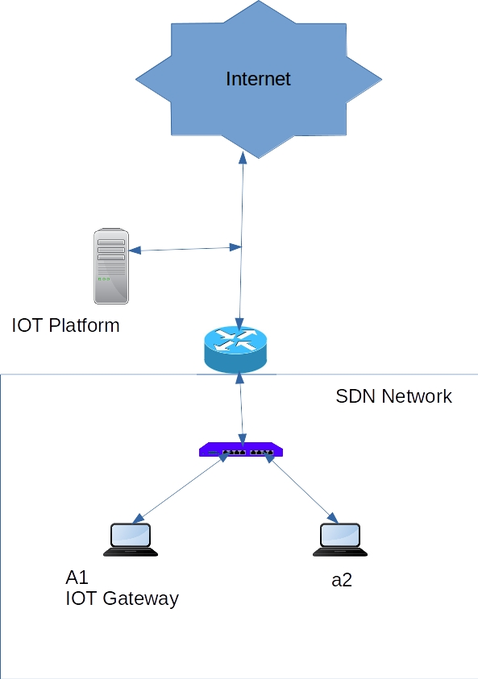
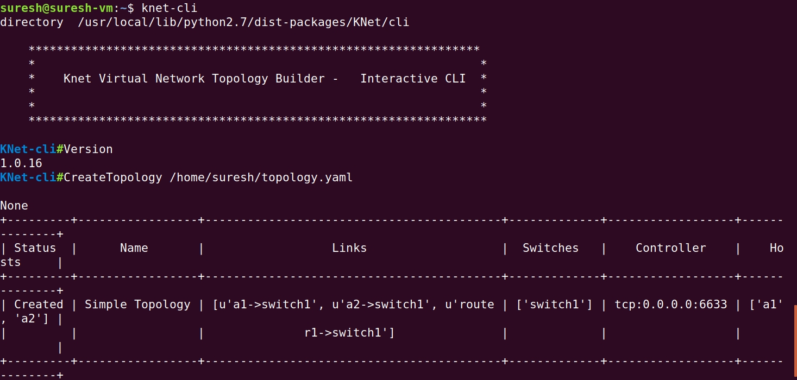
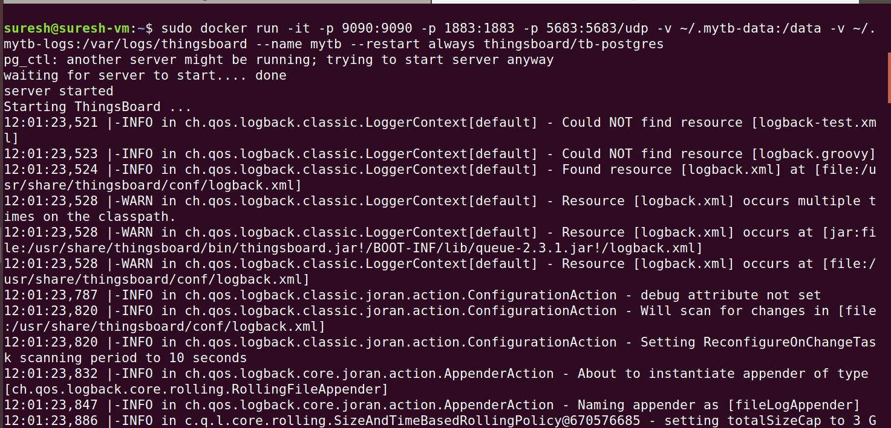
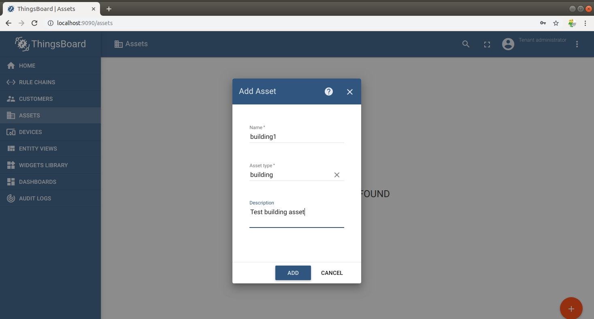
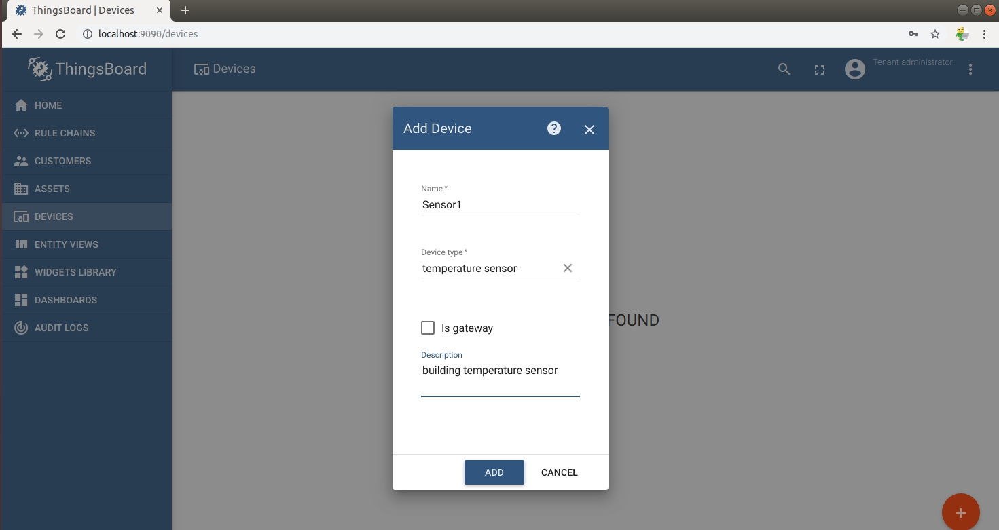
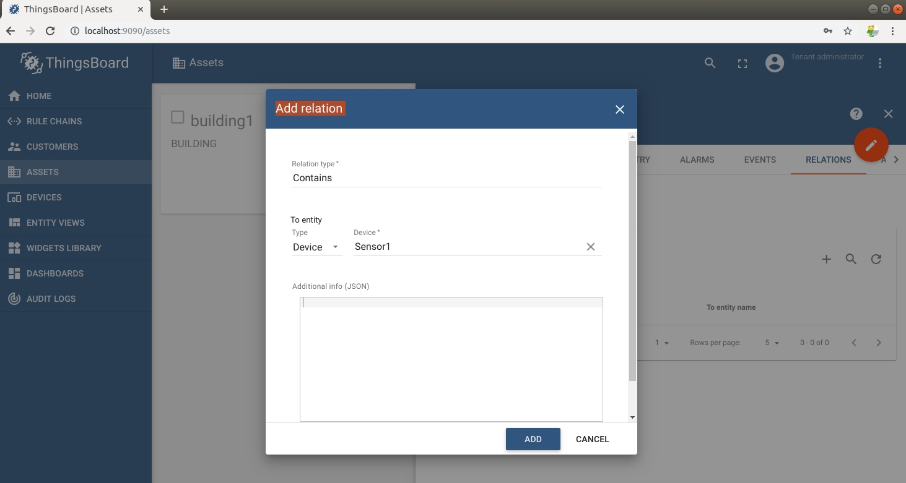
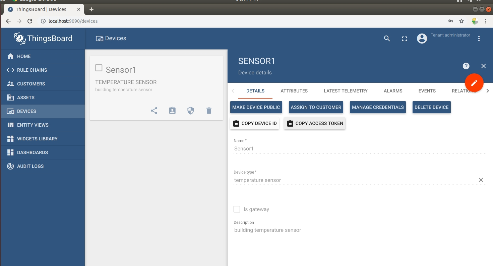
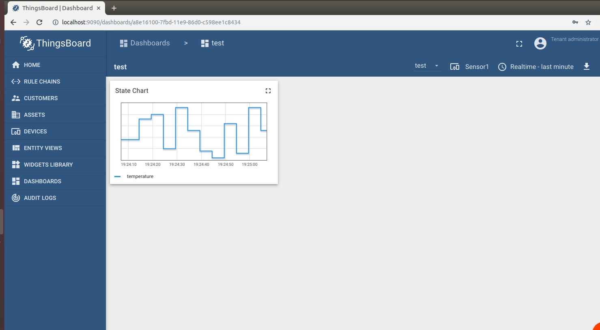

## 1. Objective

we will demonstrate the below simple use case.

Network Topology has been build by KNET and controlled by RYU SDN Controller.

IOT Gateway (which has been placed in this Network Topology) pushes the data using MQTT/CoAP/HTTP Protocols to the IOT Platform thru this Network Path which is managed by RYU SDN Controller.

we can visualize(dashboard) the received data in thingsboard IOT Platform.

we use RYU SDN Controller l4 switch application for this demonstration.


## 2. Testing

### a. Start the KNET Test bed


As first step, please run this command.

>knet-cli

we will enter in to knet-cli.


The topology details are below,



Create a topology


```
CreateTopology /home/suresh/topology.yaml

```





This topology consists of nodes(host and iotgw), switchs and router. 


### b. Start the IOT Platform (thingsboard)

open a new terminal and run the thingsboard docker image

```
sudo docker run -it -p 9090:9090 -p 1883:1883 -p 5683:5683/udp -v ~/.mytb-data:/data -v ~/.mytb-logs:/var/logs/thingsboard --name mytb --restart always thingsboard/tb-postgres

```



### C. Run the RYU SDN Controller

```
ryu-manager ryu.app.simple_switch_13
```

do pingall from knet console, and check the console logs.


### D. Verify the network connectivity

Do pingall from knet cli

>pingall

```
KNet-cli#pingall
[<KNet.lib.host.Host object at 0x7fcac4f8efd0>, <KNet.lib.host.Host object at 0x7fcac4f961d0>, <KNet.lib.router.Router object at 0x7fcac3470410>]
Ping from node a1 to a2
[sudo] password for suresh: 
PING 10.1.1.3 (10.1.1.3): 56 data bytes
64 bytes from 10.1.1.3: icmp_seq=0 ttl=64 time=0.930 ms
64 bytes from 10.1.1.3: icmp_seq=1 ttl=64 time=0.094 ms
--- 10.1.1.3 ping statistics ---


```

verify the openflow  flows

```
sudo ovs-ofctl -O OpenFlow13 dump-flows switch1
```


### E. Verify the a1(iotgw) reach the internet

```
suresh@suresh-vm:~$ sudo docker exec -it a1 bash
root@a1:/# ping google.com
PING google.com (172.217.166.110): 56 data bytes
64 bytes from 172.217.166.110: icmp_seq=0 ttl=52 time=3.611 ms
64 bytes from 172.217.166.110: icmp_seq=1 ttl=52 time=5.615 ms
^C--- google.com ping statistics ---
2 packets transmitted, 2 packets received, 0% packet loss
round-trip min/avg/max/stddev = 3.611/4.613/5.615/1.002 ms
root@a1:/# 

```


### F. Configure the IOT Platform for IOT Devices

Refer this youtube video for configuring the thingsboard IOT Platform in detail.

- https://youtu.be/TwJJbxwQX5k

Configuration Steps:

- open the IOT Platform dashboard UI (http://localhost:9090/login)
- username:  tenant@thingsboard.org   
  password:  tenant
- Add Assets
  Click Asset, Creat new asset name building.




- Add Device
  Click Device, Create new Device name sensor1




- Associate the Device to the Asset
  Click Asset, Click Building asset
  Click Relation, Add outbound relation with the device(sensor1).




Note down the device access token
  click Device, Select the Senor, copy the access token.




Using this access token, we can push the device data to this iot platform.


### G. Generate the Sensor data from IOTGW  and push it to IOT Platform

Note: take the access token from previous step.

```
suresh@suresh-vm:~/iot$ sudo docker exec -it a1 bash
root@a1:/# ls
bin  boot  dev  etc  home  lib  lib64  media  mnt  opt  proc  root  run  sbin  srv  sys  tmp  usr  var
root@a1:/# cd /opt/
root@a1:/opt# ls
coap_client.py  http_client.py  mqtt_client.py
root@a1:/opt# python http_client.py --api http://172.17.0.1:9090/api/v1/NxfB4u1TEwpcOmAPnI1m/telemetry
Namespace(api='http://172.17.0.1:9090/api/v1/NxfB4u1TEwpcOmAPnI1m/telemetry')
http://172.17.0.1:9090/api/v1/NxfB4u1TEwpcOmAPnI1m/telemetry
data {'temperature': 30}
<Response [200]>
data {'temperature': 31}
<Response [200]>
data {'temperature': 48}
<Response [200]>

```

### H. In the IOT platform, generate the dashboard and watch it





## 4. References

-https://thingsboard.io/
-https://github.com/knetsolutions/knet/
